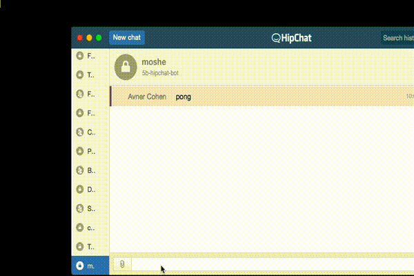

<pre>
 ______    _______      
/_____/\ /_______/\     
\::::_\/_\::: _  \ \    
 \:\/___/\\::(_)  \/_   
  \_::._\:\\::  _  \ \  
   /_____\/ \::(_)  \ \ 
   \_____/   \_______\/ 
                        
</pre>

5b Hipchat bot
===

(Background: As I was trying to setup a super simple hipchat bot, I just couldn't setup the many available ones, XMPP dependencies couldnot compile, missing libs, or very old code base.
Since I wanted something that is so f'ing simple, I opted to set up me own version.
)

### Running the Bot

(Note that ES6 Maps are used, so, if you opt for manual start, add the --harmony flag to node)
<pre>
$> npm install
$> HIP_TOKEN=your_hipchat_api_token HIP_ROOM=room_name_or_id npm start
$> Boom!
</pre>

#### Configurations
*** HIP_TOKEN *** - Api HipChat token

*** HIP_ROOM *** - Name or ID of the Hipchat room

** Optional: **

*** BOT_NAME *** - The name to be used as the bot alias, default is "5b"

#### Architecture
(Big word for small code base)
I want it to be simple, and extendible. I am perfectly fine with getting the bot to response in a delay of 2-5 seconds.
So:

1. Plugins folder is where you set up your methods. Each module should export method "run()", that's pefroms the actual command and reply with a string of some sort.
*. Every ~1.5sec a new message is searched for.
